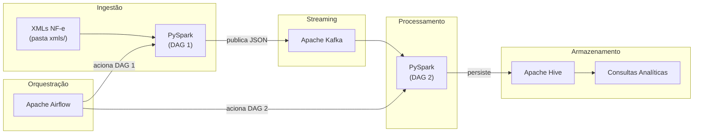

# Teste Técnico — Engenheiro de Dados Senior

## Introdução

Este teste é direcionado para profissionais que desejam atuar como **Engenheiro de Dados Senior** na **Indra Group**.

O processo seletivo prevê a contratação de 1 profissional para atuação em projetos de Big Data e Engenharia de Dados em regime presencial/híbrido.

---

## Dados

Na pasta `xmls/` deste repositório há 100 Notas Fiscais Eletrônicas (NF-e) fictícias no padrão SEFAZ (versão 3.10). Cada arquivo XML contém informações de emitente, destinatário, itens de produto, tributos e totais da nota.

> Ignore o arquivo `gerar_nfes.py`.

---

## Arquitetura Proposta

---

## Requisitos

### 1. Infraestrutura com Docker Compose

Suba toda a infraestrutura utilizando Docker Compose. Os serviços necessários são:

- **Spark Master e Worker** — cluster de processamento distribuído
- **Kafka** — broker de mensagens
- **Airflow** — orquestração dos pipelines
- **Hive** — armazenamento e consulta dos dados

Todos os serviços devem se comunicar na mesma rede Docker. Utilize volumes para persistência de dados onde aplicável.

---

### 2. DAG 1 — Leitura dos XMLs e Envio ao Kafka

Crie um script PySpark que leia os arquivos XML da pasta `xmls/`, converta cada nota fiscal para o formato JSON e publique as mensagens em um tópico Kafka.

Crie uma DAG no Airflow que orquestre a execução desse script.

---

### 3. DAG 2 — Consumo do Kafka e Persistência no Hive

Crie um script PySpark que consuma as mensagens do tópico Kafka e persista os dados no Hive.

Crie uma DAG no Airflow que orquestre a execução desse script, sendo acionada após a conclusão da DAG 1.

---

### 4. Consultas Analíticas no Hive

Crie consultas SQL executadas no Hive que demonstrem o funcionamento completo da arquitetura, utilizando contagens, somas e agrupamentos sobre os dados das notas fiscais. Os resultados das consultas devem ser salvos no próprio Hive.

---

## Instruções de Entrega

- Prazo de conclusão: **7 dias** a partir do recebimento deste teste
- Faça um **fork** deste repositório para sua conta pessoal no GitHub
- Implemente toda a solução no repositório forkado
- Inclua evidências de funcionamento (prints, logs ou arquivos de saída das consultas)
- Envie o link do repositório com todos os artefatos implementados, juntamente com seu currículo, para: **wsmarques@minsait.com**
