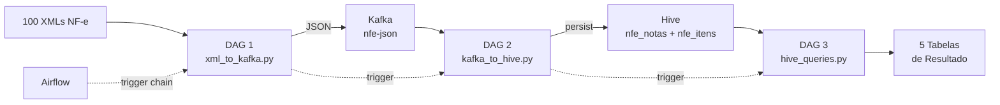

Pipeline NF-e

## Arquitetura Implementada



### PySpark Scripts

| Arquivo | Função |
|---------|--------|
| [xml_to_kafka.py]| Parseia 100 XMLs NF-e → publica JSON no Kafka |
| [kafka_to_hive.py] | Consome Kafka → persiste em `nfe_notas` + `nfe_itens` no Hive |
| [hive_queries.py] | Executa 5 consultas analíticas → salva como tabelas Hive |

### Airflow DAGs

| DAG | Trigger |
|-----|---------|
| [dag_xml_to_kafka.py] | Manual/Trigger → ao concluir, aciona DAG 2 |
| [dag_kafka_to_hive.py] | Acionada pela DAG 1 → ao concluir, aciona DAG 3 |
| [dag_hive_queries.py] | Acionada pela DAG 2 |

### Infraestrutura

| Arquivo | Alteração |
|---------|-----------|
| [docker-compose.yml] | Adicionado volumes `scripts/` e `xmls/` ao Airflow, `spark_default` connection, `DAGS_ARE_PAUSED_AT_CREATION=False` |
| [spark/Dockerfile] | Adicionado JARs do Hive Metastore + libthrift, `pip install lxml` |
| [airflow/Dockerfile] | Adicionado `lxml` ao pip install |

## Consultas Analíticas (DAG 3)

| # | Consulta | Tabela de Resultado |
|---|----------|-------------------|
| 1 | Total de notas por UF do emitente | `resultado_notas_por_uf` |
| 2 | Faturamento total por emitente | `resultado_faturamento_emitente` |
| 3 | Top 20 produtos mais vendidos | `resultado_produtos_mais_vendidos` |
| 4 | Valor total de tributos por nota | `resultado_tributos_por_nota` |
| 5 | Valor médio das notas por mês | `resultado_valor_medio_mensal` |

## Como Executar

```bash
# 1. Rebuild das imagens (necessário por causa dos Dockerfiles atualizados)
docker compose build

# 2. Subir todos os serviços
docker compose up -d

# 3. Aguardar todos os serviços ficarem healthy
docker compose ps

# 4. Trigger da DAG 1 (que vai disparar DAG 2 → DAG 3 automaticamente)
docker exec airflow-scheduler airflow dags trigger dag_xml_to_kafka
```

### Verificação

- **Airflow**: http://localhost:8081 (admin/admin)
- **Spark Master**: http://localhost:8080
- **Kafka UI**: http://localhost:8082
- **HDFS NameNode**: http://localhost:9870
- **HiveServer2 UI**: http://localhost:10002
